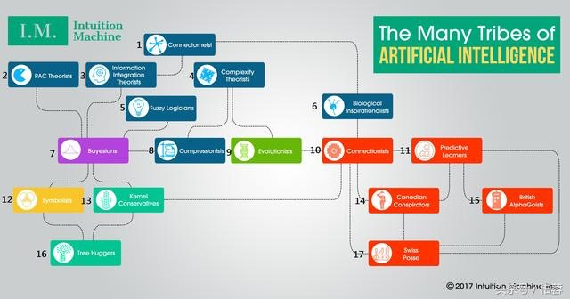

# 17门派
***

一篇来自内容发行平台Medium的文章《The Many Tribes of Artificial Intelligence（多种人工智能流派）》被广为转发。这篇文章的作者Carlos E. Perez是专注于企业级深度学习解决方案商Intuition Machine的联合创始人。
从广泛意义上，人们认为AI的诞生是1956年。但AI概念的提出时间则是1955年8月31日，在一个持续2个月、只有10个人参加的达特茅斯夏季研讨会上。在这次研讨会上，人们对AI给出的定义是：
“尝试找到如何让机器使用语言、形成抽象和概念、解决现在人类还不能解决的问题、提升自己等等。对于当下的人工智能来说首要问题是让机器像人类一样能够表现出智能。”
作者Perez认为60多年前的定义放在当下十分粗暴。在他看来，在这半个多世纪中，AI吸收各个领域的精髓，不断壮大成长。虽然在很长一段时间里，AI被“符号主义（Symbolicism）”统治，但在20世纪80年代，“新AI ”出现，人们称之为“机器学习（Machine Learning）”。而后来，还出现“Simple Learning”和“深度学习Deep Learning”。
上面是一个非常简化的AI史。实际上，AI很多学派，充满各种理论支持者。为了简单明确，作者Perez用一张图（详细见下图）不同流派之间的关系梳理出来。“人以群分物以类聚”，从图上我们可以看到17种典型的AI支持者，他们各自认同推崇的理论。

> 注：以下大多数名词均以支持某一理论的团体出现，而且都是作者自己创作的名词，维基百科等搜索平台并没有专

1. Connectomeist：这派系的人认为，智能来自大脑的连接。

2. PAC Theorists：这派人好像不务正业，相比于AI，他们更加喜欢研究智力。

3. Information Integration Theorists：这派系的人认为，意识来源于反映因果关系的内在机制。他们的口号是，想要了解意识，从现在开始思考。

4. Complexity Theorists：这学派的研究人员吸收的学科范围比较广泛，比如物理学，基于能量模型，复杂性理论，混沌理论和统计力学。预测超级碗最终比分的平台Swarm AI可以说属于这一派系。

5. Fuzzy Logicians ：曾经这一门派的理论很受欢迎，但不知道为什么最近一段时间很少见到。

6. Biological Inspirationalists：这一派倾向于打造接近生物学神经元的模型。

7. 贝叶斯学派（Bayesians）：起源于统计学，使用概率规则及其依赖关系进行推理的一派。概率图模型（PGM）是这派通用的方法，并通过蒙特卡罗方法（Monte-Carlo）进行抽样和计算。这种方法与符号主义相似之处是通过某种方式对结果进行解释。

8. Compressionists：起源于信息论 Information Theory，这派认为认知和学习就是压缩（compression）。这是一个普遍的概念，比被滥用的集合统计工具更强大。

9. 进化学派（Evolutionists）：起源于生物进化学，擅长于使用遗传算法（Genetic Algorithm，GA）和遗传编程。例如佛蒙特大学的Josh Bongard研发的基于生物进化理论的“海星机器人”，它能够通过内部模拟来“感知”身体各个部分，并进行连续建模。因此，即使没有外部编程，它也可以自己学会走路。在深度学习中，遗传算法确实有被用来替代梯度下降法，所以它不是一种孤立的方法。

10. 联结学派（Connectionists）：起源于神经科学。该派研究人员认为，智能行为来自高度互联的机制。联结主义有许多不同的形式，但最常见的形式利用了神经网络模型。在20世纪60~70年代，因为感知器（神经网络的一种形式）受到激烈批评， 联结主义销声匿迹了十年。后来因为反向传播BackPropagation算法，联结主义重获新生。

11. Predictive Learners：这是AI领域的暗物质，一个未被解决的领域。

12. 符号学派（Symbolists）：支持符号主义的拥趸。符号主义起源于逻辑学和哲学，是一种基于逻辑推理的智能模拟方法，又称为逻辑主义。早期的人工智能研究者绝大多数属于此类。该学派认为：人类认知和思维的基本单元是符号，而认知过程就是在符号表示上的一种运算。它认为人是一个物理符号系统，计算机也是一个物理符号系统，因此我们就能够用计算机来模拟人的智能行为，即用计算机的符号操作来模拟人的认知过程。
使用Lisp和Prolog属于这一派，使用 SemanticWeb，RDF 和 OWL也属于这一派。其中一个最雄心勃勃的尝试是 Doug Lenat 在80年代开发的 Cyc，试图用逻辑规则将我们对这个世界的认知进行编码。这种方法主要的缺陷在于僵化的知识库似乎总是不适用。而在现实中，存在大量模糊性和不确定性。

13. Kernel Conservatives ：这一派的研究人员喜欢他们具有数学美感的方法，他们认为深度学习只不过是炼金术士在没有对后果有所了解的情况下就念起咒语。

14. Canadian Conspirators：Hinton，LeCun，Bengio 等人推崇的无需人工进行特征工程的端到端深度学习。

15. British AlphaGoists：这门派的研究人员认为AI = 深度学习Deep Learning +强化学习Reinforcement Learning。尽管LeCun认为这种说法只是蛋糕上的樱桃。但这是初创人工智能公司DeepMind主要理论支持。

16. Tree Huggers ：采用诸如随机森林Random Forests和GBDT（Gradient Boosting Decision Tree,梯度提升决策树）等“树模型算法”的人。这些本质上都是逻辑规则的树（tree of logic rules），它们递归地分割域以构建分类器。这种方法实际上在许多 Kaggle 比赛中都相当有效。微软提出的一种方法是将基于树的模型与深度学习结合起来。

17. Swiss Posse：基本上是 LSTM以及两种结合的 RNN 解决知觉的问题。生成模型GAN也是这派发明的。据LeCun 的说法，GAN是“最近20世纪最酷的东西”。
